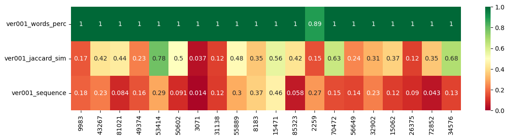
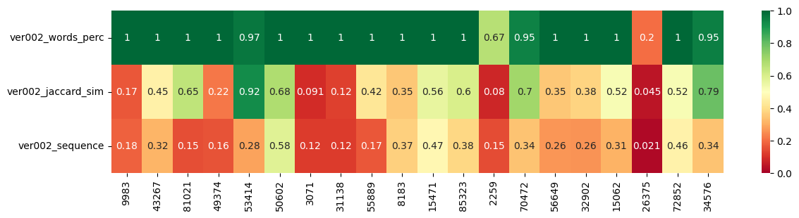
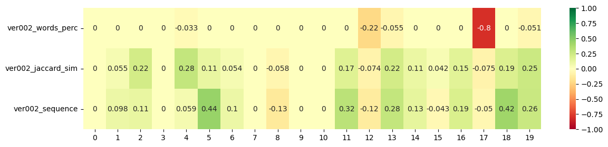
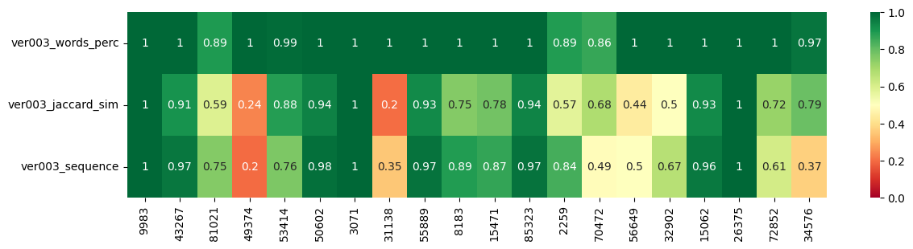

# Prompt evaluation Example

Everybody is talking about Large Language Models (LLMs) and prompt engineering. They are, well, truly large language models able to generalize and that can be applied to multiple tasks they were not trained on.

The way we instruct them how to approach new scenarios is via prompts. [Prompt engineering](https://temir.org/teaching/big-data-and-language-technologies-ss22/materials/701-prompt-engineering.pdf)$^1$ involves designing robust instructions that efectively steer LLMs towards a desire output. It has become a new usefull skill to learn.

 **An important part of prompt engineering is prompt evaluation**. The enormous power of some of these models makes them an excellent out-of-the-box solution. Small tuning of hyperparameters and a clear prompt will work wonders on most use cases. However, when we implement them in the industry, we need to evaluate their performance."

 ## Why?

Firstly, evaluating prompt output statistically **tames the probabilistic nature of LLMs into a somewhat predictable input-output box** that can be integrated into your solutions without wreaking havoc at random. Secondly, **prompt drifting**. In most cases, these models are not owned and trained by the developers but rather APIs that interact with massively large models that are continuously under development and being retrained. As they change, our desired output might do so. Finally, **developing LLM-based solutions should be done in a test-driven way**, prompts included.

## Practical example

To ilustrate, let's run a quick example. Using OpenAi's basic GPT3.5-turbo and the [squad](https://huggingface.co/datasets/squad)$^2$ dataset from datasets.

```python
from datasets import load_dataset

dataset = load_dataset("squad")
```

This dataset consists of a context, a question about it, and the correct specific answer. It is a perfect dataset to test an LLM whose goal would be to mine out specific values or ideas.

To the question: 

`To whom did the Virgin Mary allegedly appear in 1858 in Lourdes France?`

and context (cropped here for simplicity):

`[...] is a replica of the grotto at Lourdes, France where the Virgin Mary reputedly appeared to Saint Bernadette Soubirous in 1858. At the end of the main drive (and in a direct line that connects through 3 statues and the Gold Dome), is a simple [...]`

the desired answer would be:

`Saint Bernadette Soubirous`

GPT3.5, out of the box is able to perform the task:

```python
response = openai.ChatCompletion.create(
    model="gpt-3.5-turbo",
    messages=[
      {"role": "system", "content": context},
      {"role": "user", "content": query},
    ]
  )
print(response.get("choices")[0]["message"]["content"])
```
`The Virgin Mary allegedly appeared to Saint Bernadette Soubirous in 1858 in Lourdes, France.`

Which is technically correct but verbose.

## Define tests

```python
from difflib import SequenceMatcher
from promptimize import evals

def sequence_matcher(a, b):
    return SequenceMatcher(None, a, b).ratio()

def jaccard_similarity(a, b):
    intersection = len(set(a).intersection(set(b)))
    union = len(set(a).union(set(b)))
    return intersection / union
```
[Promptimize](https://pypi.org/project/promptimize/)$^3$ is one example of many open-source tools being developed at the moment to help with prompt evaluation. It has some basic evaluation functions defined that we can use.

```python
evals.percentage_of_words(answer,exact_answer[0])
1.0
```

*percentage_of_words* meassures from 0 to 1 the percentage of words from a list that are present in the given response.
This one is our basic test, the desired answer should be included in the output.

**SequenceMatcher** is a class in the difflib module of Python that provides a way to compare pairs of sequences of any type, as long as the sequence elements are hashable.

```python
sequence_matcher(answer,exact_answer[0])
0.4406779661016949
```

The idea is to find the longest contiguous matching subsequence that contains no “junk” elements (these “junk” elements are ones that are uninteresting in some sense, such as blank lines or whitespace). The same idea is then applied recursively to the pieces of the sequences to the left and to the right of the matching subsequence.

The **Jaccard similarity** coefficient, also known as the Jaccard index, is a statistic used for gauging the similarity and diversity of sample sets. It measures similarity between finite sample sets, and is defined as the size of the intersection divided by the size of the union of the sample sets. In other words, it is calculated as:

```
Jaccard Similarity = (number of observations in both sets) / (number in either set) or J(A, B) = |A∩B| / |A∪B|
```
```python
jaccard_similarity(answer,exact_answer[0])
0.4666666666666667
```

The Jaccard similarity ranges from 0 to 1. The closer to 1, the more similar the two sets of data are. If two datasets share the exact same members, their Jaccard Similarity Index will be 1. Conversely, if they have no members in common then their similarity will be 0.

Sequence matcher and Jaccard similarity are the tests that allow us to meassure how close the output is to the desired answer. A 1 in these would mean that they are identical, but their range between 0 and 1 allow us to see progression.

Out of the box, we have a model that is able to find the correct answer but is too verbose. Let’s try to improve it while testing statistically.

## Testing

Let's select a few random entries

```python
import numpy as np

# set the seed for reproducibility
np.random.seed(42)

# randomly select 20 rows from the dataframe
corpus = df.sample(n=20)

# we are not interested in the placement of the answer, so making it the straight entry
corpus['answers'] = corpus['answers'].apply(lambda x: x['text'][0])

corpus.head(3)
```

### Version 1 - Out of the box performance

Let's make a call to our model for every sample in our corpus df

```python
VERSION = "ver001"

corpus[f'{VERSION}_llm_answer'] = corpus.apply(lambda row:
    openai.ChatCompletion.create(
        model="gpt-3.5-turbo",
        messages=[
        {"role": "system", "content": row['context']},
        {"role": "user", "content": row ['question']},
        ]
    ).get("choices")[0]["message"]["content"],
    axis = 1
    )
```
After applying our tests, we have the following results:



As we have seen before, the model excels at identifying the correct answer but is way too verbose. The percentage of desired words is high but the similarity of the strings is low overall.

### Version 2 - Specific Prompt

Let’s see how it responds with a proper prompt and defined hyperparameters. The new expanded system message includes instructions besides the context.

```python
config = {
    "temperature": 0,
    "max_tokens": 16,
    "top_p": 1,
}

corpus_v2[f'{VERSION}_llm_answer'] = corpus_v2.apply(lambda row:
  openai.ChatCompletion.create(
      model="gpt-3.5-turbo",
      messages=[
      {"role": "system", "content": 
        f"""
        You are an API given the following context: /n
        ###
        {row['context']}
        ###
        Will reply as concisely as possible to the user question.
        """
      },
      {"role": "user", "content": row ['question']},
      ],
    temperature=config["temperature"],
    max_tokens=config["max_tokens"],
    top_p=config["top_p"],
  ).get("choices")[0]["message"]["content"],
  axis = 1
  )
  ```


Quite poor still.

```python
print(f'To the question: {corpus_v2.iloc[-3]["question"]}')
print(f'with the desired answer: {corpus_v2.iloc[-3]["answers"]}')
print(f'Version 1 answered: {corpus_v2.iloc[-3]["ver001_llm_answer"]}')
print(f'Version 2 answered: {corpus_v2.iloc[-3]["ver002_llm_answer"]}')
```
To the question: When did Houston begin to regain its dependence on the oil industry?

with the desired answer: 2000s

Version 1 answered: Houston began to regain its dependence on the oil industry in the 2000s, specifically after the increase in oil prices during that time.

Version 2 answered: Houston began to regain its dependence on the oil industry since the increase of oil prices`

However, If we compare with the previous version, we can appreciate some timid progression towards concise answers:

```python
# Select columns with ver001 and ver002
ver001_cols = corpus.columns[-3:]
ver002_cols = corpus_v2.columns[-3:]

# Calculate the difference between ver001 and ver002 columns
diff_df = corpus_v2[ver002_cols].values - corpus_v2[ver001_cols].values

```


From an exploration, it looks like our instruction of being concise is not producing the desired effect. Maybe the model understands its short phrase answers as concise already. We are likely to have failed communicating to it that we want just the exact piece of data.

### Version 3 - Improved Prompt

Let’s try this time rewording the last phrase in our prompt from:

```Will reply as concisely as possible to the user question.```

to 

``` Will reply concisely, using as few words as possible, to the user question.```

```python
corpus_v3[f'{VERSION}_llm_answer'] = corpus_v3.apply(lambda row:
  openai.ChatCompletion.create(
      model="gpt-3.5-turbo",
      messages=[
      {"role": "system", "content": 
        f"""
        You are an API given the following context: /n
        ###
        {row['context']}
        ###
        Will reply concisely, using as few words as possible, to the user question.
        """
      },
      {"role": "user", "content": row ['question']},
      ],
    temperature=config["temperature"],
    max_tokens=config["max_tokens"],
    top_p=config["top_p"],
  ).get("choices")[0]["message"]["content"],
  axis = 1
  )
  ```


Much better! Now the model is refraining itself from giving verbose answers.
```python
print(f'To the question: {corpus_v3.iloc[0]["question"]}')
print(f'with the desired answer: {corpus_v3.iloc[0]["answers"]}')
print(f'Version 1 answered: {corpus_v3.iloc[0]["ver001_llm_answer"]}')
print(f'Version 3 answered: {corpus_v3.iloc[0]["ver003_llm_answer"]}')
```

To the question: What year was the Banská Akadémia founded?

with the desired answer: 1735

Version 1 answered: The Banská Akadémia in Banská Štiavnica, Slovakia was founded in 1735.

Version 3 answered: 1735`

With a simple change in the prompt, we have greatly improved our out-of-the-box solution, and we have measurable metrics to account for it.

Now we can iteratively improve our prompt with a real comprehension of the impact of our changes in the prompt wording. 

# Conclusion

Although LLMs’ outputs are probabilistic in nature, their related solutions and prompts should be developed in a test-driven way. Developing efforts will profit from tests providing metrics that can be measured and accounted for.

As we have seen in a brief practical example, setting tests that define how the output of our LLM should behave, we can follow a test-driven development. In this way, development is easier as we understand better the shortcomings, we can assure the net improvement of a given change, and we can set a quality threshold to meet.


[1](https://temir.org/teaching/big-data-and-language-technologies-ss22/materials/701-prompt-engineering.pdf) ``` Introduction to Prompt Engineering - Temir. ```

[2](https://huggingface.co/datasets/squad) ``` Rajpurkar, P., Zhang, J., Lopyrev, K., & Liang, P. (2016). SQuAD: 100,000+ Questions for Machine Comprehension of Text. arXiv e-prints, arXiv:1606.05250. ```

[3](https://pypi.org/project/promptimize/) ```promptimize. (2021). Promptimize. PyPI.```